# foodduck DB 테이블 구성도

- 접속 정보: MySQL 8.0.45 / DB명 `foodduck`
- 조회 일시: 2026-08-05
- 전체 테이블 수: 33개 (Flyway 마이그레이션 이력 테이블 `flyway_schema_history` 포함)

## 1. 테이블 목록

| # | 테이블명 | 설명(코멘트) | Row 수 |
|---|---|---|---|
| 1 | account | 계정 | 38 |
| 2 | account_authority | 계정-권한 매핑 | 39 |
| 3 | account_credential | 일반 로그인 자격 정보 | 35 |
| 4 | admin_action_log | 관리자 작업 이력 | 0 |
| 5 | authority | 권한 정의 | 3 |
| 6 | business_application | 사업자 신청 | 0 |
| 7 | business_profile | 사업자 프로필 | 0 |
| 8 | data_import_history | 외부 음식점 데이터 적재 이력 | 0 |
| 9 | email_verification | 이메일 인증 | 0 |
| 10 | favorite | 찜 | 0 |
| 11 | flyway_schema_history | (Flyway 마이그레이션 이력, 시스템 테이블) | 3 |
| 12 | menu | 음식점 메뉴 | 0 |
| 13 | menu_submission | 사용자 메뉴 제보 | 0 |
| 14 | notification | 알림 | 0 |
| 15 | post | 게시글 | 15 |
| 16 | post_comment | 댓글 | 98 |
| 17 | post_like | 게시글 추천(중복 방지) | 12 |
| 18 | post_media | 게시글 미디어 | 0 |
| 19 | post_tag | 게시글 태그 | 0 |
| 20 | preset | 프리셋(찜 리스트) 소유자 | 0 |
| 21 | preset_restaurant | 프리셋에 담긴 음식점 | 0 |
| 22 | public_restaurant | 공공데이터(상가업소정보) 음식점 | 827,828 |
| 23 | refresh_token | 리프레시 토큰 해시 | 5 |
| 24 | restaurant | 음식점(사장님 등록) | 0 |
| 25 | restaurant_category | 음식점 카테고리 | 0 |
| 26 | restaurant_image | 음식점 이미지 | 0 |
| 27 | restaurant_news | 음식점 소식 | 0 |
| 28 | restaurant_tag | 음식점-태그 매핑 | 0 |
| 29 | review | 리뷰(평균 평점/리뷰 수는 집계 조회) | 0 |
| 30 | signup_email_verification | 회원가입 이메일 인증번호 | 5 |
| 31 | social_account | 소셜 로그인 연결 | 4 |
| 32 | tag | 태그 | 0 |
| 33 | user_category_preference | 사용자 선호 카테고리 | 0 |
| 34 | user_tag_preference | 사용자 선호 태그 | 0 |

> `public_restaurant`의 원본 코멘트는 인코딩 손상(mojibake)이 있어 "공공데이터(상가업소정보) 음식점"으로 정리해 표기했습니다. 실제 DB의 `TABLE_COMMENT` 값을 그대로 확인하려면 `SHOW TABLE STATUS`로 재조회가 필요합니다.

## 2. 도메인 그룹

- **계정/인증**: account, account_authority, account_credential, authority, social_account, refresh_token, email_verification, signup_email_verification
- **사업자 신청/운영**: business_application, business_profile, restaurant, restaurant_category, restaurant_image, restaurant_news, menu, menu_submission
- **음식점 데이터(공공데이터)**: public_restaurant, data_import_history
- **게시판/커뮤니티**: post, post_comment, post_like, post_media, post_tag, tag
- **음식점 상호작용**: favorite, review, restaurant_tag
- **프리셋(찜 리스트/큐레이션)**: preset, preset_restaurant
- **추천/개인화**: user_category_preference, user_tag_preference
- **관리/운영 로그**: admin_action_log, notification
- **시스템**: flyway_schema_history

## 3. ERD (Mermaid)

```mermaid
erDiagram
    account ||--o{ account_authority : "has"
    authority ||--o{ account_authority : "granted_to"
    account ||--o| account_credential : "has"
    account ||--o{ admin_action_log : "performs(admin)"
    account ||--o{ business_application : "applies"
    account ||--o{ business_application : "processes(admin)"
    account ||--o| business_profile : "owns"
    business_application ||--o| business_profile : "origin_of"
    account ||--o{ email_verification : "requests"
    account ||--o{ favorite : "marks"
    restaurant ||--o{ favorite : "favorited_by"
    restaurant ||--o{ menu : "has"
    restaurant ||--o{ menu_submission : "target_of"
    account ||--o{ menu_submission : "submits"
    account ||--o{ menu_submission : "processes(admin)"
    account ||--o{ notification : "receives"
    account ||--o{ post : "writes"
    restaurant ||--o{ post : "referenced_by"
    public_restaurant ||--o{ post : "referenced_by"
    post ||--o{ post_comment : "has"
    account ||--o{ post_comment : "writes"
    post ||--o{ post_like : "liked_by"
    account ||--o{ post_like : "likes"
    post ||--o{ post_media : "has"
    post ||--o{ post_tag : "tagged_with"
    tag ||--o{ post_tag : "tags"
    account ||--o{ preset : "owns"
    preset ||--o{ preset_restaurant : "contains"
    public_restaurant ||--o{ preset_restaurant : "referenced_by"
    restaurant ||--o{ preset_restaurant : "referenced_by(owner)"
    account ||--o{ refresh_token : "has"
    account ||--o{ restaurant : "owns"
    restaurant_category ||--o{ restaurant : "categorizes"
    restaurant_category ||--o{ restaurant_category : "parent_of"
    restaurant ||--o{ restaurant_image : "has"
    restaurant ||--o{ restaurant_news : "publishes"
    restaurant ||--o{ restaurant_tag : "tagged_with"
    tag ||--o{ restaurant_tag : "tags"
    restaurant ||--o{ review : "reviewed"
    public_restaurant ||--o{ review : "reviewed"
    account ||--o{ review : "writes"
    account ||--o{ social_account : "links"
    account ||--o{ user_category_preference : "prefers"
    restaurant_category ||--o{ user_category_preference : "preferred_by"
    account ||--o{ user_tag_preference : "prefers"
    tag ||--o{ user_tag_preference : "preferred_by"
```

## 4. 외래키(FK) 전체 목록

| 자식 테이블 | 컬럼 | 부모 테이블 | 부모 컬럼 | ON DELETE |
|---|---|---|---|---|
| account_authority | account_id | account | account_id | CASCADE |
| account_authority | authority_id | authority | authority_id | RESTRICT |
| account_credential | account_id | account | account_id | CASCADE |
| admin_action_log | admin_account_id | account | account_id | SET NULL |
| business_application | account_id | account | account_id | NO ACTION |
| business_application | processed_by | account | account_id | NO ACTION |
| business_profile | account_id | account | account_id | NO ACTION |
| business_profile | application_id | business_application | application_id | NO ACTION |
| email_verification | account_id | account | account_id | CASCADE |
| favorite | account_id | account | account_id | NO ACTION |
| favorite | restaurant_id | restaurant | restaurant_id | NO ACTION |
| menu | restaurant_id | restaurant | restaurant_id | NO ACTION |
| menu_submission | account_id | account | account_id | RESTRICT |
| menu_submission | processed_by | account | account_id | SET NULL |
| menu_submission | restaurant_id | restaurant | restaurant_id | RESTRICT |
| notification | account_id | account | account_id | NO ACTION |
| post | account_id | account | account_id | NO ACTION |
| post | public_restaurant_id | public_restaurant | public_restaurant_id | RESTRICT |
| post | restaurant_id | restaurant | restaurant_id | NO ACTION |
| post_comment | account_id | account | account_id | NO ACTION |
| post_comment | post_id | post | post_id | NO ACTION |
| post_like | account_id | account | account_id | NO ACTION |
| post_like | post_id | post | post_id | NO ACTION |
| post_media | post_id | post | post_id | CASCADE |
| post_tag | post_id | post | post_id | CASCADE |
| post_tag | tag_id | tag | tag_id | RESTRICT |
| preset | account_id | account | account_id | CASCADE |
| preset_restaurant | owner_restaurant_id | restaurant | restaurant_id | CASCADE |
| preset_restaurant | preset_id | preset | preset_id | CASCADE |
| preset_restaurant | public_restaurant_id | public_restaurant | public_restaurant_id | CASCADE |
| refresh_token | account_id | account | account_id | CASCADE |
| restaurant | category_id | restaurant_category | category_id | NO ACTION |
| restaurant | owner_account_id | account | account_id | NO ACTION |
| restaurant_category | parent_id | restaurant_category | category_id | NO ACTION (self-reference) |
| restaurant_image | restaurant_id | restaurant | restaurant_id | CASCADE |
| restaurant_news | restaurant_id | restaurant | restaurant_id | NO ACTION |
| restaurant_tag | restaurant_id | restaurant | restaurant_id | NO ACTION |
| restaurant_tag | tag_id | tag | tag_id | NO ACTION |
| review | account_id | account | account_id | NO ACTION |
| review | public_restaurant_id | public_restaurant | public_restaurant_id | RESTRICT |
| review | restaurant_id | restaurant | restaurant_id | NO ACTION |
| social_account | account_id | account | account_id | CASCADE |
| user_category_preference | account_id | account | account_id | CASCADE |
| user_category_preference | category_id | restaurant_category | category_id | CASCADE |
| user_tag_preference | account_id | account | account_id | CASCADE |
| user_tag_preference | tag_id | tag | tag_id | CASCADE |

## 5. 설계 상 주요 패턴

- **`account`가 사실상 중심 허브 테이블**: 대부분의 도메인 테이블이 `account_id`(작성자/소유자/신청자) FK를 가진다.
- **음식점 이원화 구조**: 자체 등록 음식점은 `restaurant`, 공공데이터 기반 음식점은 `public_restaurant`로 분리되어 있고, `post`/`review`/`preset_restaurant`는 두 참조 컬럼(`restaurant_id`, `public_restaurant_id`)을 모두 갖되 **CHECK 제약조건**(`chk_post_single_source`, `chk_review_single_source`, `chk_preset_restaurant_single_source`)으로 "둘 중 하나만 채워지도록" 강제한다.
- **소프트 삭제**: `account`, `post`, `post_comment`, `restaurant`, `restaurant_news`, `review`는 `deleted_at` 컬럼(혹은 `status='DELETED'`)으로 소프트 삭제를 지원한다.
- **부분 유니크 제약을 위한 STORED GENERATED 컬럼**: `business_application`은 `status='PENDING'`일 때만 값이 채워지는 `pending_account_id`/`pending_business_number` 생성 컬럼에 유니크 인덱스를 걸어, "계정당/사업자번호당 진행 중 신청은 1건만" 제약을 MySQL에서 흉내낸다.
- **집계 캐시 컬럼**: `post.like_count`, `post.view_count`는 실시간 집계 대신 캐시 컬럼으로 관리된다(코멘트에 명시).
- **선호도 학습 테이블**: `user_category_preference`, `user_tag_preference`는 `preference_score DECIMAL(5,4)` (0~1 범위, CHECK 제약)로 추천 시스템에 사용되는 것으로 보인다.
- **전문 검색 인덱스**: `public_restaurant`에는 ngram 파서를 사용하는 FULLTEXT 인덱스(`ft_public_restaurant_search`)가 있어 한글 상호명/주소 검색에 대응한다.
- **위치 검색 인덱스**: `restaurant`, `public_restaurant` 모두 `(latitude, longitude)` 복합 인덱스를 가진다.
