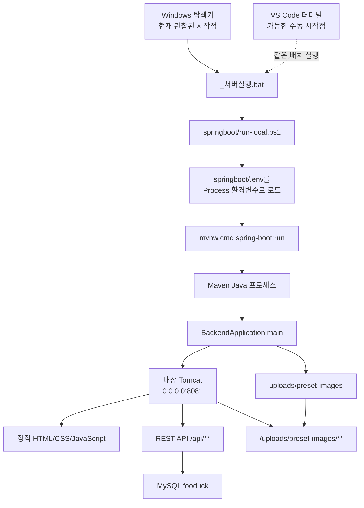
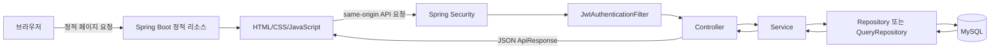

# VS Code 개발 실행 구조

> 조사 대상: `C:\Users\sdedu01\Documents\GitHub\SD_Project_FD`
>
> 실행 상태 확인 시각: 2026-08-10 17:39:02 KST
>
> 조사 원칙: 파일·프로세스·포트는 읽기 전용으로 확인했으며, 비밀값은 기록하지 않았다.

## 1. 한눈에 보는 결론

- FOODUCK은 별도 프런트엔드 서버 없이 Spring Boot 애플리케이션 하나가 정적 화면과 REST API를 함께 제공한다.
- 팀 공통 Windows 실행 경로는 `_서버실행.bat` → `springboot/run-local.ps1` → `.env` 로드 → Maven Wrapper → `BackendApplication.main()` 순서다.
- 현재 실행 중인 서버도 이 경로로 시작됐으며, 내장 Tomcat이 `0.0.0.0:8081`에서 응답하고 있다.
- 브라우저의 정적 JavaScript는 같은 출처의 `/api`를 호출하고, 요청은 Spring Security/JWT → Controller → Service → Repository → MySQL로 흐른다.
- `springboot/ai`의 Python/SQLite 코드는 현재 Spring Boot 실행 또는 추천 API에 연결되지 않은 독립 콘솔 실험 코드다.

## 2. 현재 관찰된 실행 상태

### 2.1 서버와 포트

| 항목 | 실제 관찰 결과 |
|---|---|
| 확인 시각 | 2026-08-10 17:39:02 KST |
| 애플리케이션 프로세스 | `java.exe`, PID `27844`, Eclipse Adoptium JDK 17 |
| 애플리케이션 진입점 | `com.example.backend.BackendApplication` |
| Maven 프로세스 | `java.exe`, PID `29872`, Maven Wrapper 3.9.16, 목표 `spring-boot:run` |
| 리스닝 포트 | `0.0.0.0:8081`, PID `27844` |
| 기동 확인 | `GET http://localhost:8081/api/hello` → `200`, `Content-Type: application/json` |
| Python 프로세스 | 발견되지 않음 |
| 별도 `mvn.exe` 프로세스 | 발견되지 않음. Maven Wrapper가 Java 프로세스로 Maven을 실행하므로 정상이다. |

현재 부모 프로세스와 명령행을 역추적한 결과는 다음과 같다.

```text
explorer.exe
└─ cmd.exe /c "...\_서버실행.bat"
   └─ powershell.exe ... -File "...\springboot\run-local.ps1"
      └─ cmd.exe /c "...\springboot\mvnw.cmd" spring-boot:run
         └─ java.exe ... Maven ... spring-boot:run
            └─ java.exe ... com.example.backend.BackendApplication
```

따라서 **현재 서버는 VS Code 통합 터미널이나 Run 버튼이 아니라 Windows 탐색기에서 `_서버실행.bat`를 실행해 시작된 것**으로 판별된다. 다만 설정상 같은 배치 파일을 VS Code 터미널에서 실행해도 이후 호출 순서는 같다.

VS Code와 관련된 Java 프로세스도 두 개(PID `21968`, `27480`) 관찰됐지만, 경로가 VS Code Red Hat Java 확장의 번들 JRE 21이고 애플리케이션 진입점이나 8081 포트를 소유하지 않으므로 언어 서버/확장 런타임이다. 실제 FOODUCK Maven과 애플리케이션은 JDK 17을 사용한다.

### 2.2 확인 범위와 한계

- 운영체제 프로세스와 명령행, 부모 PID, TCP 리스닝 포트는 읽기 전용으로 확인했다.
- VS Code 통합 터미널의 탭 이름, 과거 명령 이력, 터미널 내부 환경변수는 운영체제 프로세스 조회만으로 직접 볼 수 없다.
- 실행 중인 Java 프로세스의 환경변수 값은 조회하지 않았다. `.env`도 키 이름만 확인했다.
- MySQL에 다시 접속하거나 스키마를 조회하지 않았다. 개발 DB 상태는 기존 DB 정리 문서를 근거로 별도 표시한다.
- 로컬 3306 리스너는 프로젝트 관련 포트 확인에서 발견되지 않았다. `DB_URL`의 실제 목적지는 비밀정보 보호를 위해 기록하지 않는다.

## 3. 실행 진입점과 호출 순서



호출 단계별 역할은 다음과 같다.

1. `_서버실행.bat`가 `springboot/mvnw.cmd`, `springboot/run-local.ps1`, `springboot/.env`의 존재와 Java 실행 가능 여부를 검사한다. 이후 PowerShell 실행 정책을 현재 호출에 한해 우회해 `run-local.ps1`을 호출한다. (`_서버실행.bat:6-50`)
2. `run-local.ps1`은 `.env`의 빈 줄과 주석을 제외한 `KEY=VALUE`를 현재 PowerShell 프로세스 환경변수로 넣는다. 자식 Maven/Java 프로세스가 이를 상속한다. (`springboot/run-local.ps1:13-27`)
3. 스크립트는 `springboot`를 작업 디렉터리로 삼고 `mvnw.cmd spring-boot:run`을 실행한다. 실행 전 기존 `target` 파일의 읽기 전용 속성만 해제할 수 있다. (`springboot/run-local.ps1:29-40`)
4. Maven의 Spring Boot 플러그인이 Java 17 클래스패스를 구성하고 `BackendApplication.main()`을 시작한다. (`springboot/pom.xml:117-123`, `springboot/src/main/java/com/example/backend/BackendApplication.java:8-14`)
5. Spring Boot가 내장 웹 서버, 보안 필터, Controller/Service/Repository, 데이터소스와 정적 리소스 제공 기능을 구성한다.

## 4. VS Code 설정

### 4.1 저장소에 포함된 설정

| 구분 | 확인 결과 | 근거 |
|---|---|---|
| 공통 편집 설정 | UTF-8, LF, 파일 끝 개행, 후행 공백 제거 | `.vscode/settings.json:4-7` |
| 자동 포맷 | 저장 시 자동 포맷은 꺼짐 | `.vscode/settings.json:9-10` |
| Java 들여쓰기 | 4칸 | `.vscode/settings.json:13-15` |
| HTML/CSS/JS 포매터 | Prettier 지정 | `.vscode/settings.json:18-26` |
| Java 분석 | Null 분석 자동, 빌드 구성 갱신은 대화형 | `.vscode/settings.json:27-28` |
| 추천 확장 | Java Extension Pack, Spring Boot Extension Pack, Prettier, GitLens | `.vscode/extensions.json:3-8` |
| `.vscode/launch.json` | 없음 | 파일 존재 여부 확인 |
| `.vscode/tasks.json` | 없음 | 파일 존재 여부 확인 |

### 4.2 Run 버튼과 실행 스크립트의 차이

- 저장소에는 Run/Debug 구성을 고정하는 `launch.json`과 작업을 정의하는 `tasks.json`이 없다.
- VS Code의 Java/Spring 확장이 표시하는 Run 버튼은 확장이 발견한 `BackendApplication.main()`을 직접 실행하는 사용자 환경 의존 기능이다.
- 저장소 설정만으로는 Run 버튼이 `springboot/.env`를 먼저 읽는다고 보장할 수 없다. DB/JWT 환경변수가 VS Code 자체 환경에 없다면 직접 실행은 실패할 수 있다.
- `_서버실행.bat` 또는 `run-local.ps1`은 `.env` 존재를 확인하고 값을 자식 프로세스에 전달하므로 현재 프로젝트에서 재현 가능한 Windows 실행 경로다.
- VS Code의 번들 JRE 21은 편집/분석에 사용 중이지만, Maven Wrapper로 실행된 FOODUCK은 `pom.xml`의 Java 17 기준과 일치하는 JDK 17을 사용한다.

## 5. Spring Boot 실행 구조

### 5.1 빌드와 애플리케이션 시작

- Spring Boot 부모 버전은 4.0.7이고 Java 기준 버전은 17이다. (`springboot/pom.xml:5-18`)
- 웹 MVC, Spring Data JPA, MySQL Connector, Flyway, Spring Security, Validation, Mail, JWT 의존성을 하나의 Maven 모듈에서 사용한다. (`springboot/pom.xml:19-97`)
- 테스트/로컬 검증에는 Spring MVC Test, Spring Security Test와 H2를 사용한다. (`springboot/pom.xml:99-114`)
- `BackendApplication`의 `@SpringBootApplication`이 컴포넌트 스캔과 자동 구성을 시작하고, `@EnableScheduling`이 스케줄링을 활성화한다. (`springboot/src/main/java/com/example/backend/BackendApplication.java:8-13`)

### 5.2 요청 처리 계층

일반적인 서버 데이터 흐름은 다음과 같다.

```text
Controller → Service → Repository/QueryRepository → JDBC/JPA → MySQL
```

- Controller는 `/api/**` HTTP 요청과 DTO 바인딩을 담당한다.
- Service는 인증된 계정, 정책, 트랜잭션과 업무 규칙을 처리한다.
- Repository 또는 QueryRepository는 JPA/SQL을 통해 MySQL을 조회·변경한다.
- 공통 예외 처리기는 업무 예외를 일관된 JSON 응답으로 변환한다.

### 5.3 정적 화면과 보안

- `springboot/src/main/resources/static` 아래 177개 리소스가 빌드 클래스패스에 포함되며 Spring Boot가 `/`, `/pages/**`, `/css/**`, `/js/**`, `/images/**` 등으로 제공한다.
- 보안 설정은 세션을 만들지 않는 `STATELESS` 방식이며 JWT 필터를 `UsernamePasswordAuthenticationFilter` 앞에 둔다. (`springboot/src/main/java/com/example/backend/global/config/SecurityConfig.java:40-68`)
- 정적 파일, 인증 API, 공개 API, `/api/hello`, Presset GET 등은 허용하고 그 외 요청은 인증 또는 역할을 요구한다. (`SecurityConfig.java:52-66`)
- 프런트 공통 API 모듈은 `/api`를 기준 URL로 사용하고, 토큰이 있으면 `Authorization: Bearer ...`를 붙인다. FormData가 아닌 본문만 JSON으로 직렬화한다. (`springboot/src/main/resources/static/js/api.js:5-40`)

### 5.4 Presset 이미지 업로드

- 기본 저장 설정은 `PRESET_IMAGE_UPLOAD_DIR`이 없을 때 상대 경로 `uploads/preset-images`다. (`springboot/src/main/resources/application.properties:75-78`)
- 실행 스크립트가 작업 디렉터리를 `springboot`로 옮기므로 표준 실행에서 실제 기본 위치는 `springboot/uploads/preset-images`다.
- `PresetImageStorage`는 시작 시 디렉터리를 만들고 UUID 기반 파일명으로 파일을 저장한다. (`springboot/src/main/java/com/example/backend/preset/storage/PresetImageStorage.java:22-39`)
- `WebMvcConfig`가 같은 디렉터리를 `/uploads/preset-images/**` URL에 연결한다. (`springboot/src/main/java/com/example/backend/global/config/WebMvcConfig.java:16-23`)
- 업로드 제한은 파일 5MB, 요청 전체 6MB다. 파일 메타데이터는 `preset_image` 테이블을 사용하는 별도 QueryRepository가 관리한다.

## 6. 환경변수

`.env`의 값은 출력하거나 문서에 기록하지 않았고, 현재 파일에 존재하는 키 이름만 확인했다. 현재 확인된 키는 `DB_URL`, `DB_USERNAME`, `DB_PASSWORD`, `JWT_SECRET`, `KAKAO_REST_API_KEY`, `KAKAO_CLIENT_SECRET`, `KAKAO_MAPS_JAVASCRIPT_KEY`, `NAVER_CLIENT_ID`, `NAVER_CLIENT_SECRET`, `GOOGLE_CLIENT_ID`, `GOOGLE_CLIENT_SECRET`이다.

| 변수명 | 사용 목적 | 필수 여부 | 설정상 기본값 |
|---|---|---|---|
| `JAVA_HOME` | 배치 파일과 Maven이 사용할 JDK 위치 | 권장. 없으면 `PATH`의 Java 사용 | 없음 |
| `DB_URL` | MySQL JDBC 주소 | 서버 기동에 필수 | 없음 |
| `DB_USERNAME` | MySQL 계정 | 서버 기동에 필수 | 없음 |
| `DB_PASSWORD` | MySQL 비밀번호 | 서버 기동에 필수 | 없음 |
| `SERVER_PORT` | 내장 웹 서버 포트 | 선택 | `8081` |
| `JPA_DDL_AUTO` | Hibernate 스키마 정책 | 선택 | `validate` |
| `JPA_SHOW_SQL` | SQL 로그 표시 | 선택 | `false` |
| `FLYWAY_ENABLED` | Flyway 자동 실행 여부 | 선택. 기존 개발 DB에서는 활성화 금지 | `false` |
| `JWT_SECRET` | JWT 서명 키 | 인증 기능/기동에 필수 | 없음 |
| `JWT_ACCESS_TOKEN_VALIDITY` | 액세스 토큰 유효기간(ms) | 선택 | `1800000` |
| `JWT_REFRESH_TOKEN_VALIDITY` | 리프레시 토큰 유효기간(ms) | 선택 | `1209600000` |
| `OAUTH_STATE_SECRET` | OAuth state 서명 | OAuth 사용 시 필요 | `JWT_SECRET` 사용 |
| `OAUTH_STATE_VALIDITY` | OAuth state 유효기간(ms) | 선택 | `300000` |
| `OAUTH_TICKET_VALIDITY` | OAuth 교환 티켓 유효기간(ms) | 선택 | `120000` |
| `OAUTH_SUCCESS_URI` | OAuth 성공 후 화면 | 선택 | localhost 8081 콜백 화면 |
| `SECURE_COOKIES` | HTTPS 보안 쿠키 사용 | 배포 환경에서 필요 | `false` |
| `KAKAO_REST_API_KEY`, `KAKAO_CLIENT_SECRET` | Kakao 로그인 | 기능 사용 시 필요 | 빈 값 |
| `KAKAO_REDIRECT_URI` | Kakao OAuth 콜백 | 선택 | localhost 8081 API 콜백 |
| `NAVER_CLIENT_ID`, `NAVER_CLIENT_SECRET` | Naver 로그인 | 기능 사용 시 필요 | 빈 값 |
| `NAVER_REDIRECT_URI` | Naver OAuth 콜백 | 선택 | localhost 8081 API 콜백 |
| `GOOGLE_CLIENT_ID`, `GOOGLE_CLIENT_SECRET` | Google 로그인 | 기능 사용 시 필요 | 빈 값 |
| `GOOGLE_REDIRECT_URI` | Google OAuth 콜백 | 선택 | localhost 8081 API 콜백 |
| `KAKAO_MAPS_JAVASCRIPT_KEY` | 브라우저 Kakao 지도 SDK | 지도 기능 사용 시 필요 | 빈 값 |
| `PUBLIC_DATA_RESTAURANT_SERVICE_KEY` | 공공 음식점 API | 동기화 기능 사용 시 필요 | 빈 값 |
| `BUSINESS_REGISTRATION_VERIFY_SERVICE_KEY` | 사업자등록 진위 확인 API | 검증 기능 사용 시 필요 | 빈 값 |
| `MAIL_HOST`, `MAIL_PORT` | SMTP 서버 | 메일 기능 사용 시 필요 | `smtp.gmail.com`, `587` |
| `MAIL_USERNAME`, `MAIL_PASSWORD` | SMTP 인증 | 메일 기능 사용 시 필요 | 빈 값 |
| `EMAIL_VERIFICATION_CODE_VALIDITY` | 인증번호 유효기간(ms) | 선택 | `300000` |
| `EMAIL_VERIFICATION_VALIDITY` | 이메일 인증 상태 유효기간(ms) | 선택 | `1800000` |
| `CORS_ALLOWED_ORIGINS` | 허용할 웹 출처 | 분리 배포 시 조정 | `http://localhost:8081` |
| `PRESET_IMAGE_UPLOAD_DIR` | Presset 이미지 저장 디렉터리 | 선택 | `uploads/preset-images` |
| `SPRING_PROFILES_ACTIVE` | Spring 프로필 선택 | 선택 | 기본 프로필 |
| `PYTHON_EXECUTABLE`, `PYTHON_SCRIPT_PATH` | 로컬 예제의 Python 추천 설정 자리 | 현재 Java 코드에서는 사용되지 않음 | `python`, 빈 값(예제 파일 기준) |

핵심 런타임 매핑은 `springboot/src/main/resources/application.properties:1-78`에 있으며, 로컬 프로필 예시는 `application-local-example.properties:1-22`에 있다. `.env` 파일 자체는 Git에 올리지 않는다.

## 7. 데이터베이스와 Flyway

### 7.1 개발 MySQL

- 기본 데이터소스는 MySQL이며 `DB_URL`, `DB_USERNAME`, `DB_PASSWORD`를 요구한다. (`application.properties:4-9`)
- JPA는 기본적으로 테이블을 만들거나 고치지 않고 `ddl-auto=validate`로 매핑만 검증한다. (`application.properties:11-14`)
- Flyway는 `FLYWAY_ENABLED=false`가 기본이다. 빈 MySQL 8 DB를 처음 구성할 때만 마이그레이션을 순서대로 적용하는 것이 저장소 정책이다. (`application.properties:21-24`, `springboot/src/main/resources/db/migration/README.md:3-12`)

기존 개발 DB에 대해서는 `docs/001.DB정리/001-03. Flyway 이력과 실제 DB 불일치 및 preset_image 생성.md`의 조사 결과를 따른다.

- Flyway 이력은 V6에서 멈췄지만 이후 구조 일부는 수동 DDL로 적용돼 있어 SQL 파일 목록과 실제 이력이 일치하지 않는다. (해당 문서 `:20-46`)
- `FLYWAY_ENABLED=true`로 켜면 누락된 V4.1 검증 오류가 발생한다. `outOfOrder`, `repair`, 이력 조작으로 우회하면 안 된다. (해당 문서 `:7-14`, `:54-58`)
- 누락됐던 `preset_image`는 V12와 같은 구조로 수동 생성됐다. 이후 V11 대상 컬럼은 기존 값을 백업한 다음 수동 제거됐고, 이미지 유무별 Presset 등록과 기존 데이터 보존이 검증됐다. (해당 문서 `:60-83`, `:85-124`)
- `preset.name`과 백업 테이블은 별도 판단 전 삭제하지 않는 잔여 항목이다. (해당 문서 `:126-130`)

이 문서 작성 과정에서는 위 내용을 재실행하거나 DB를 변경하지 않았다.

### 7.2 테스트 H2와 실제 MySQL의 차이

| 구분 | 테스트 | 개발 실행 |
|---|---|---|
| DB 엔진 | 메모리 H2, MySQL 호환 모드 | MySQL 8 |
| 연결 | 테스트 프로세스 내부 `fooduck_test` | 환경변수로 주입한 외부 MySQL |
| 스키마 정책 | `create-drop`, `schema.sql` 항상 실행 | `validate`, 수동 관리된 기존 스키마 |
| Flyway | 비활성화 | 기본 비활성화 |
| 데이터 수명 | 테스트 종료 시 소멸 | 기존 개발 데이터 유지 |
| 스키마 근거 | `src/test/resources/schema.sql` | 실제 MySQL + 수동 DDL 이력 |

테스트 설정 근거는 `springboot/src/test/resources/application-test.properties:1-13`이고, 테스트용 Presset/Preset 이미지 구조는 `springboot/src/test/resources/schema.sql:78-110`이다. H2 테스트 통과만으로 실제 MySQL의 제약조건과 수동 DDL 상태까지 같다고 판단하면 안 된다.

## 8. 프런트엔드 요청 흐름



1. 브라우저는 8081의 정적 페이지를 직접 받는다. 별도 Node 개발 서버나 프런트엔드 빌드 프로세스는 없다.
2. `static/js/api.js`는 `baseUrl: "/api"`로 같은 출처를 호출하고 `credentials: "same-origin"`을 사용한다. (`api.js:5-6`, `:24-40`)
3. 로그인 후 액세스 토큰은 `localStorage`에서 읽어 Bearer 헤더로 전달된다. 401이면 리프레시 요청을 한 번 시도한다. (`api.js:9-21`, `:31-33`, `:48-86`)
4. 보안 화이트리스트에 없는 API는 JWT 인증을 통과해야 Controller에 도달한다.
5. Controller가 Service를 호출하고, Service가 Repository를 통해 DB에 접근한 뒤 공통 JSON 응답을 반환한다.
6. 이미지가 포함된 Presset 요청은 `FormData`이므로 브라우저가 multipart boundary를 지정하도록 공통 모듈이 `Content-Type: application/json`을 강제로 넣지 않는다. (`api.js:24-29`, `:36-40`)

## 9. Python AI 폴더

| 항목 | 확인 결과 |
|---|---|
| 실행 진입점 | `springboot/ai/app.py` |
| 실행 방식 | `while True`와 `input()`을 사용하는 대화형 콘솔 프로그램 |
| DB | `sqlite3.connect("restaurant.db")`를 사용하는 로컬 SQLite |
| FastAPI/웹 서버 | FastAPI, Uvicorn, HTTP 라우트가 없음 |
| Spring Boot 연결 | Java 코드에서 Python 프로세스 실행, HTTP 호출, `restaurant.db` 사용 근거가 없음 |
| 현재 프로세스 | Python 프로세스 없음 |
| 메인 서비스 포함 여부 | 포함되지 않음. 실험용/독립 실행 코드 |

`application-local-example.properties:21-22`와 운영 예제에는 Python 실행 파일/스크립트 경로 속성이 남아 있지만, 전체 Java 소스 검색에서 이를 읽거나 `ProcessBuilder`로 실행하는 코드가 발견되지 않았다. 실제 `GET /api/recommendations`는 Java `RecommendationController`가 `RecommendationPreviewService`를 호출하고, 이 서비스가 `RecommendationQueryRepository`의 DB 데이터를 집계한다. (`RecommendationController.java:12-26`, `RecommendationPreviewService.java:23-42`, `:121-127`)

근거 파일은 `springboot/ai/app.py:1-21`, `springboot/ai/database.py:1-32`다. Python 폴더를 실행해도 현재 Spring Boot 서버에 자동 연결되지 않는다.

## 10. 개발·테스트 명령

다음 명령은 Windows PowerShell 기준이다. 서버 시작/종료와 Maven 빌드 명령은 사용 방법을 문서화한 것이며, 이번 조사에서는 실행 중인 서버를 종료·재시작하거나 Maven 빌드를 새로 수행하지 않았다.

### 서버 실행

프로젝트 루트에서 팀 공통 경로:

```powershell
.\_서버실행.bat
```

PowerShell 스크립트를 직접 호출:

```powershell
powershell.exe -NoLogo -NoProfile -ExecutionPolicy Bypass -File .\springboot\run-local.ps1
```

이미 필요한 환경변수가 현재 셸에 설정돼 있다면 Maven만 직접 실행할 수 있다. 이 방법은 `.env`를 자동으로 읽지 않는다.

```powershell
Set-Location .\springboot
.\mvnw.cmd spring-boot:run
```

### 서버 종료

- 서버를 시작한 콘솔에서 `Ctrl+C`를 누른다.
- 현재 프로세스는 배치 파일에서 시작됐으므로 해당 FOODUCK Server 콘솔에서 종료해야 한다.
- 작업 관리자 강제 종료는 정상 종료가 불가능할 때만 사용한다.

### 테스트와 패키징

```powershell
Set-Location .\springboot

# 전체 테스트
.\mvnw.cmd test

# 특정 테스트 클래스
.\mvnw.cmd -Dtest=PresetControllerIntegrationTest test

# 테스트를 포함한 패키징
.\mvnw.cmd package
```

테스트는 H2 메모리 DB를 사용하므로 개발 MySQL 데이터를 변경하지 않는다. 다만 Maven 명령은 `springboot/target` 산출물을 갱신한다.

### JavaScript 구문 검사

한 파일:

```powershell
node --check .\springboot\src\main\resources\static\js\api.js
```

정적 리소스의 모든 JavaScript:

```powershell
Get-ChildItem .\springboot\src\main\resources\static -Recurse -Filter *.js |
    ForEach-Object { node --check $_.FullName }
```

조사 시 설치된 Node.js는 v24.18.0이었고, 정적 JavaScript 30개에 대해 `node --check` 오류가 없었다.

### 정상 기동 확인 URL

- 메인 화면: `http://localhost:8081/`
- 서버 확인 API: `http://localhost:8081/api/hello`
- 검색: `http://localhost:8081/pages/search/`
- 지도: `http://localhost:8081/pages/map/`
- Presset: `http://localhost:8081/pages/presset/`
- 추천: `http://localhost:8081/pages/recommendation/`

## 11. 자주 발생할 수 있는 문제

| 증상 | 확인 지점 | 대응 방향 |
|---|---|---|
| `.env` 없음 | `_서버실행.bat` 또는 `run-local.ps1`이 즉시 오류 | `springboot/.env`를 만들되 비밀값은 Git에 추가하지 않는다. |
| Java/JAVA_HOME 오류 | 배치 파일의 Java 검사, `java -version` | JDK 17을 설치하고 `JAVA_HOME` 또는 `PATH`를 맞춘다. VS Code 번들 JRE와 서버 JDK를 혼동하지 않는다. |
| MySQL 연결 실패 | 서버 시작 로그의 JDBC/Hikari 최하위 예외 | `DB_URL`, 계정, 방화벽, MySQL 가동 상태를 확인한다. 비밀값을 로그나 문서에 복사하지 않는다. |
| 8081 포트 충돌 | `Get-NetTCPConnection -LocalPort 8081 -State Listen` | PID 소유자를 확인한다. 기존 프로세스를 임의 종료하지 말고 필요한 경우 `SERVER_PORT`를 명시적으로 조정한다. |
| JWT_SECRET 길이 오류 | 서버 시작 또는 토큰 발급 로그 | UTF-8 기준 32바이트 이상의 키를 안전하게 주입한다. 실제 키는 저장소에 기록하지 않는다. |
| Flyway 검증 실패 | V4.1 누락 관련 `FlywayValidateException` | 기존 개발 DB에서는 `FLYWAY_ENABLED=true`, `repair`, `outOfOrder`를 사용하지 않는다. DB 정리 문서를 먼저 확인한다. |
| Maven Wrapper 다운로드 실패 | `.mvn/wrapper`, 사용자 Maven 캐시, 네트워크 | 인터넷/프록시와 파일 권한을 확인한다. Maven 별도 설치는 필수가 아니다. |
| Maven 산출물 읽기 전용 | `springboot/target` 갱신 실패 | 표준 `run-local.ps1`이 기존 target 파일의 읽기 전용 속성을 해제한다. 원인을 모른 채 target 전체를 삭제하지 않는다. |
| 업로드 디렉터리 오류 | 시작 로그 또는 이미지 저장 500 | `PRESET_IMAGE_UPLOAD_DIR` 경로의 생성·쓰기 권한과 디스크 공간을 확인한다. 기본 경로는 `springboot/uploads/preset-images`다. |
| VS Code Run은 실패하고 배치는 성공 | Run 버튼 환경에 DB/JWT 변수가 없음 | 저장소에 launch 설정이 없으므로 표준 배치/PowerShell 경로를 사용하거나 별도 승인 후 명시적 launch 구성을 만든다. |
| 테스트는 성공하지만 개발 DB에서 실패 | H2와 실제 MySQL 스키마 차이 | 실제 MySQL의 `SHOW CREATE TABLE`과 수동 DDL 이력을 읽기 전용으로 비교한다. |

## 12. 근거 파일 목록

| 상대 경로 | 핵심 근거 |
|---|---|
| `.vscode/settings.json:4-28` | 인코딩, EOL, 포매터, Java 편집 설정 |
| `.vscode/extensions.json:3-8` | 팀 추천 확장 |
| `_서버실행.bat:6-50` | 파일/JDK 검사와 PowerShell 진입점 |
| `springboot/run-local.ps1:13-40` | `.env` 로드, 작업 디렉터리, Maven 실행 |
| `springboot/mvnw.cmd` | Windows Maven Wrapper 진입점 |
| `springboot/pom.xml:5-18` | Spring Boot 4.0.7, Java 17 |
| `springboot/pom.xml:19-123` | 웹/DB/보안/테스트 의존성과 Spring Boot 플러그인 |
| `springboot/src/main/java/com/example/backend/BackendApplication.java:8-14` | Java 메인 클래스 |
| `springboot/src/main/resources/application.properties:1-78` | 포트, MySQL, Flyway, JWT/OAuth, CORS, 업로드 설정 |
| `springboot/src/main/resources/application-local-example.properties:1-22` | 로컬 프로필과 선택적 Python 속성 예시 |
| `springboot/.env` | 현재 키 이름만 확인. 값은 출력·기록하지 않음 |
| `springboot/src/main/java/com/example/backend/global/config/SecurityConfig.java:40-68` | 보안 허용 경로, 권한, JWT 필터 |
| `springboot/src/main/java/com/example/backend/global/config/WebMvcConfig.java:16-23` | 업로드 파일 URL 매핑 |
| `springboot/src/main/java/com/example/backend/preset/storage/PresetImageStorage.java:22-47` | 업로드 디렉터리 생성, 저장·삭제 |
| `springboot/src/main/resources/static/js/api.js:5-86` | 동일 출처 `/api`, JWT, JSON/FormData, 401 갱신 |
| `springboot/src/main/resources/db/migration/README.md:3-12` | 빈 DB 전용 Flyway 정책 |
| `springboot/src/test/resources/application-test.properties:1-13` | H2, create-drop, schema.sql, Flyway 비활성화 |
| `springboot/src/test/resources/schema.sql:78-110` | 테스트용 Preset 관련 스키마 |
| `springboot/ai/app.py:1-21` | Python 대화형 콘솔 진입점 |
| `springboot/ai/database.py:1-32` | SQLite 데이터 생성 코드 |
| `springboot/src/main/java/com/example/backend/recommendation/controller/RecommendationController.java:12-26` | 실제 추천 API의 Java 진입점 |
| `springboot/src/main/java/com/example/backend/recommendation/service/RecommendationPreviewService.java:23-42` | Java/DB 기반 추천 집계 |
| `README.md:5-17`, `:77-172`, `:206-215` | 단일 애플리케이션 구조, 실행, DB, 테스트 안내 |
| `docs/001.DB정리/001-03. Flyway 이력과 실제 DB 불일치 및 preset_image 생성.md:20-130` | 실제 개발 DB의 Flyway/수동 DDL 조사 기록 |

프로세스·포트 근거는 파일이 아니라 2026-08-10 17:39 KST의 `Get-Process`, `Get-CimInstance Win32_Process`, `netstat -ano -p tcp`, 로컬 `/api/hello` 응답을 통해 확인했다. VS Code 통합 터미널 내부 상태는 직접 확인할 수 없었지만, 부모 프로세스가 `explorer.exe`인 점과 전체 명령행으로 현재 실행 진입점을 판별했다.
